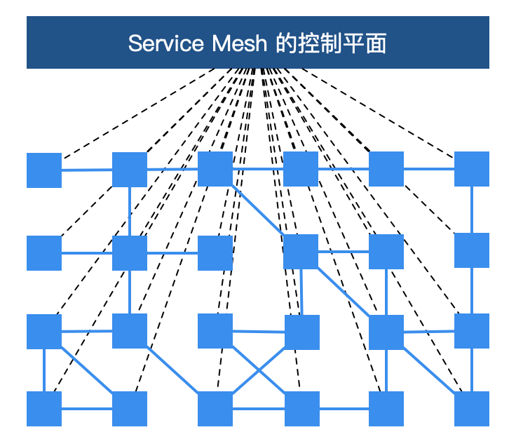

# 2.	服务网格

服务网格 （Service Mesh）是一个用于管理、观测、支持工作负载实例之间安全通信的管理层。服务网格通常以轻量级网络代理阵列的形式实现，这些代理与应用程序代码部署在一起，而对应用程序来说无需感知代理的存在。服务网格通常由控制平面和数据平面两部分组成。数据平面运行在Sidecar中，Sidecar作为一个独立的容器和业务系统运行在同一个Kubernetes的Pod里面，或者作为一个独立的进程和应用程序进程运行在同一个虚拟机上，其主要充当业务系统的网络流量的代理。传统 RPC中的服务发现、限流、熔断、链路追踪等能力都会下沉到Sidecar中。Sidecar为应用程序提供了一个透明的网络基础设施，让业务在低侵入或者零侵入的情况获得更健壮的网络通信能力。

服务网格为微服务带来新的变革，主要体现在：**服务治理与业务逻辑解耦，** 服务网格把SDK中的大部分能力从应用中剥离出来，拆解为独立进程，以Sidecar的模式部署，将服务通信及相关管控功能从业务程序中分离并下层到基础设施层，使其和业务系统完全解耦，使开发人员更加专注于业务本身；**异构系统的统一治理，** 通过服务网格技术将主体的服务治理能力下沉到基础设施，可方便地实现多语言、多协议的统一流量管控、监控等需求。

服务网格相对于传统微服务框架拥有较多优势：**超强的通信线路数据观察性，** 服务网格是一个专用的管理层，鉴于它在技术堆栈中处于独特的位置，所有的服务间通信都要经由服务网格，以便在服务调用级别上提供统一的遥测指标；**“面向目的地的”流量控制能力，** 由于服务网格的设计目的是有效地将来源请求调用连接到其最优目标服务实例，所以这些流量控制特性是“面向目的地的”，而这也正是服务网格流量控制能力的一大特点。通过服务网格，可以为服务提供智能路由（蓝绿部署、金丝雀发布、A/B test）、超时重试、熔断、故障注入、流量镜像等各种控制能力；**微服务网络的增强安全特性，** 在某种程度上，单体架构应用受其单地址空间的保护。一旦单体架构应用被分解为多个微服务，网络就会成为一个重要的攻击面，更多的服务意味着更多的网络流量，这对黑客来说意味着更多的机会来攻击信息流，而服务网格恰恰提供了保护网络调用的能力。服务网格的安全相关的好处主要体现在以下三个核心领域：服务的认证、服务间通讯的加密、安全相关策略的强制执行。

服务网格带来了巨大变革，拥有其强大的技术优势，被称为第二代“微服务架构”。然而软件开发没有银弹，传统微服务架构有许多痛点，而服务网格也有它的局限性：**网络复杂性大幅增加，** 服务网格将 Sidecar 代理和其它组件引入到已经很复杂的分布式环境中，会极大地增加整体链路和操作运维的复杂性；**学习曲线较为陡峭，** 当前的服务网格几乎都建立在以 Kubernetes为基础的云原生环境上，服务网格的运维人员需要同时掌握Kubernetes和服务网格两种技术，才能应对使用中的问题，增加用户的学习成本；**系统调用存在额外性能开销，** 服务网格在服务链路中引入了Sidecar proxy，因在系统调用中增加了跳转而带来了延迟。虽然该延迟是毫秒级别的，在大多数场景下是可以接受的，但是在某些需要高性能低延迟的的业务场景下，可能是难以容忍的。